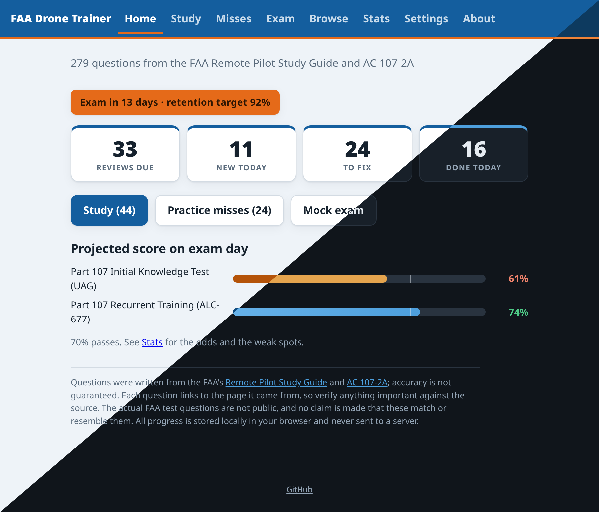

# FAA Drone Trainer

[](https://github.com/ullbergm/faa-drone-test-training/actions/workflows/ci.yml)
[](https://github.com/ullbergm/faa-drone-test-training/releases)
[](LICENSE)
[](https://faa-drone.ullberg.io)

[](data/questions.js)
[](package.json)
[](manifest.webmanifest)
[](CONTRIBUTING.md)
[](https://www.conventionalcommits.org/en/v1.0.0/)

Practice questions with spaced repetition for the FAA Part 107 remote pilot
knowledge test and the recurrent training knowledge check. The bank has 279
multiple-choice questions written from the
[Remote Pilot Study Guide (FAA-G-8082-22)](https://www.faa.gov/sites/faa.gov/files/regulations_policies/handbooks_manuals/aviation/remote_pilot_study_guide.pdf)
and [AC 107-2A](https://www.faa.gov/documentLibrary/media/Advisory_Circular/AC_107-2A.pdf),
which covers the rules added after the study guide was published: night
operations, operations over people, and remote identification. Every question
cites the page it was drawn from, as a link that opens the PDF at that page.

Live at [faa-drone.ullberg.io](https://faa-drone.ullberg.io), or run it yourself.
There is no build step, no dependencies, and no server. Just open `index.html` in
a browser. All progress is stored locally in the browser and never sent anywhere.
Settings has export and import for backups or for moving between devices.

<p align="center">
  
</p>
<p align="center">
  <a href="docs/screenshots/README.md">More screenshots</a>
</p>

## Modes

- **Study**: the spaced repetition queue. Due reviews plus a daily allotment of new
  cards, drawn round-robin across the selected sections and interleaved with the
  reviews. Wrong answers come back a few cards later in the same session. Correct
  answers are rated Hard, Good, or Easy, which tells the scheduler how the recall felt.
  Feel like doing more once the queue is empty? The home and session-complete screens
  offer 5, 10, or 25 extra new cards; the extra applies to today only and your
  configured pace is untouched.
- **Misses**: re-drills every question whose last answer was wrong, without touching
  the review schedule. Answering one correctly removes it from the pool.
- **Exam**: mock knowledge tests in the real format. No feedback until the end, and
  70% to pass. The list mirrors the real assessments (the 60-question initial
  knowledge test and the 45-question recurrent knowledge check) and shows only the
  tests selected in Settings. Missed exam questions feed the Misses pool.
- **Browse**: the whole bank by section, with each card's schedule and accuracy.
- **Stats**: exam readiness, mastery counts, day streak, 7-day due forecast,
  per-section accuracy, and exam history.

On a keyboard, 1 through 4 pick an answer, Enter continues after a wrong answer,
and 1/2/3 (or Enter for Good) grade a correct one. A stray tap is not final: an
Undo button (or the U key) on the feedback screen takes back the answer and asks
the question again, as long as you have not yet continued or graded. The buttons
show badges for their shortcut keys on devices with a mouse and keyboard; on
touch screens the badges stay hidden.

In Settings, under "Tests I'm studying for", check only what you are preparing
for next: the initial test if you are new, or the recurrent knowledge check if
your certificate is coming up on 24 calendar months. Everything else stays out
of the queue until you check it, and progress on unchecked sections is kept.

Part 108, the FAA's proposed rule for flying beyond visual line of sight, is
still a proposed rule with no test behind it. A section for it is planned for
when the FAA finalizes the rule and publishes testable material.

## Scheduling

The scheduler implements [FSRS-6](https://github.com/open-spaced-repetition)
(Free Spaced Repetition Scheduler) with its published default parameters. FSRS
models each card with three quantities:

- Difficulty: how hard the card is for you, on a scale of 1 to 10, adjusted by
  each answer.
- Stability: how durable the memory is, measured as the number of days until recall
  probability falls to 90%. Successful reviews grow it, and a miss collapses it.
- Retrievability: the predicted chance of recalling the card right now, which decays
  along a power-law forgetting curve.

Each review updates difficulty and stability from your rating, then schedules the
next review for the day retrievability is predicted to reach the target, shortly
before you would likely forget. Intervals grow quickly for cards you keep getting
right and reset for cards you miss. Repeat answers within the same day use a
separate short-term memory formula. Intervals of three days or more get a small
deterministic fuzz (up to about 5%) so cards learned together drift apart
instead of always coming due on the same day.

Every scheduled review is also appended to a compact log (question, rating,
timestamp) that is kept with your progress and included in backups. Nothing
reads it yet; it exists so a future version can fit the FSRS parameters to
your actual review history instead of the published defaults, which the
aggregate card state alone could never support.

## Studying for a date

Set your test date in Settings and the scheduler optimizes for that day instead of
indefinite retention:

- The retention target ramps from 90% to 95% over the final three weeks.
- No review is scheduled past the exam. Anything that would land later is pulled
  back to exam day.
- If the daily new-card pace is too slow to cover every remaining question in time,
  it is raised automatically. Your stored setting is untouched, the boost is shown
  on the home screen, and it goes away when the date is cleared.
- In the last five days a "Final review sweep" appears on the home screen. It goes
  through every card, weakest memory first, ignoring due dates.

Without an exam date the app runs at your own pace with the normal 90% target. The
same applies automatically once the date passes.

## Am I ready

The home screen projects a score for each test you are studying for, and Stats
breaks the same projection down with the odds and what is dragging it. Both come
from the memory model the scheduler already maintains, so the number moves with
your actual reviews rather than with a running average of past answers.

Each question is one trial: either the answer is recalled, at the retrievability
FSRS predicts for the moment of the test, or it is not and the guess still lands
one time in four. A question you have never seen is a straight guess. The real
test draws its questions from a much larger pool, so the projected score is the
pool average, and the spread around it accounts for both the draw and the recall
itself. The chance of passing is the probability that the draw clears 70%.

Two counts explain a low projection. Unseen questions are the ones the queue has
not reached yet. Rusty ones have been studied but are predicted to fall below the
90% recall the scheduler targets by test day, which is what the review queue is
there to fix. Without an exam date the projection is for taking the test today.

The projection assumes the bank is representative of the real test, which is a
study aid's assumption, not a promise. Treat it as a direction, not a score
report.

## Layout

```
index.html               app shell
css/engine.css           structural styling, synced from the trainer-engine repo
css/app.css              this app's color tokens (light/dark follows the device; Settings can force either)
js/fsrs.js               FSRS-6 scheduler
js/readiness.js          projected score and pass odds per test
js/storage.js            localStorage persistence, export/import
js/app.js                UI and session logic
data/questions.js        question bank (279 questions, tagged by section and source page)
data/manual-pages.js     printed page labels to PDF page numbers, for the citation links
data/exam-config.js      what exam this is: tests, pass mark, manual links, exam-specific prose
tools/                   regenerates that map from local copies of the FAA PDFs, and the icons
sw.js                    service worker (offline cache, only active on the hosted site)
manifest.webmanifest     PWA manifest, lets the app be installed to a home screen
icons/                   app icons (icon.svg is the source, PNGs rendered from it)
tests/validate-bank.js   question bank schema checks (node)
tests/fsrs-test.js       FSRS scheduler property tests (node)
tests/readiness-test.js  readiness projection tests, incl. a Monte Carlo check (node)
tests/test.html          end-to-end tests driven through the real UI
tests/run-browser.sh     headless-Chrome runner for test.html (local + CI)
docs/question-authoring.md  the recipe the question bank was written with
docs/screenshots/        README images and the script that regenerates them
```

On the hosted site the app is an installable PWA: a service worker caches
everything on first load, so it keeps working offline, and "Add to home screen"
installs it like an app. Each release stamps its version into the service
worker, so open tabs notice the new deploy, show a "new version is ready"
toast, and switch over cleanly on reload; otherwise the release is picked up
on the next load.

## Building a trainer for another exam

The engine under `js/` knows nothing about Part 107, and the test suites derive
their assertions from the config and the bank, so a trainer for a different
manual-based exam is a matter of replacing data and identity files. Create a
new repository from this one and touch:

- `data/questions.js`: the new question bank, tagged by section and manual page;
  [docs/question-authoring.md](docs/question-authoring.md) is the recipe, written
  to be followed by a person or handed to a language model per section
- `data/exam-config.js`: the tests and exams, pass mark, manual links, storage
  keys, and every piece of prose that names the exam
- `data/manual-pages.js`: regenerate with `node tools/gen-manual-pages.js`; the
  footer-label parsing in that script is written for the FAA PDFs this trainer
  cites, so adjust it to the new manual's page numbering
- `css/app.css`: the token blocks set all colors and the progress-bar
  texture; everything structural lives in `css/engine.css`, which is synced
  from the [trainer-engine](https://github.com/ullbergm/trainer-engine) repo
- `index.html`: title, meta description, canonical URL, brand text, favicon,
  theme color
- `manifest.webmanifest`, `icons/`, `CNAME`: PWA identity and hosting; redraw
  `icons/icon.svg` and rerun `tools/gen-icons.sh` for the PNGs
- `package.json`: name and description
- `.github/ISSUE_TEMPLATE/question-correction.yml`: names the manual in its
  field description
- `docs/screenshots/seed.js`: the demo scenario behind the README screenshots
- `README.md`, `CONTRIBUTING.md`, `SECURITY.md`: name the repository, the live
  site, and the release artifact

The GitHub workflows and the service worker derive their names from the
repository and need no edits. The release tarball is named after the repo, so
`SECURITY.md`'s verification example follows it.

One engine assumption to keep in mind: every question offers exactly four
choices. Manual citations are optional at every level: a question may cite a
page of any manual in the config's `manuals` map, a manual without a public
URL renders its citations as plain text instead of PDF links, and an exam
with nothing citable leaves the map empty and the `page` fields off.

## Releases and deployment

Two workflows in `.github/workflows/`:

- CI (`ci.yml`) validates the question bank and runs the browser test suite on every
  push to `main` and every pull request.
- Release (`release.yml`) uses [release-please](https://github.com/googleapis/release-please)
  to maintain a release PR from [Conventional Commit](https://www.conventionalcommits.org/)
  messages. Merging that PR tags a version, publishes a GitHub release with a
  generated changelog, and deploys to GitHub Pages. Ordinary pushes to `main` do not
  touch the live site. The deploy job re-runs the tests before publishing.

To run the checks locally:

```
npm install          # one time, dev tooling only (the app itself has no dependencies)
npm run lint
npm test             # question bank validation, FSRS scheduler, readiness projection
npm run test:browser # end-to-end suite in headless Chrome or Chromium
```

Every line should say `PASS`. Opening `tests/test.html` in a normal browser also
works, with the results printed at the bottom of the page. The test page clears the
app's localStorage for its origin, so do not run it in the browser profile where you
keep real study progress.

## Accuracy

The questions were authored from the FAA's own text, section by section. Accuracy
is not guaranteed. Each question carries the page it came from (a study guide page
like `17`, or an AC 107-2A label like `5-14`) and links to that page in the PDF,
so verify anything important against the source. The actual FAA test questions are
not publicly available, and no claim is made that these questions match or resemble
them. This is a study aid for the source material, not a copy of the test. If a
question reads wrong, check the cited page and edit `data/questions.js`, which is a
plain JSON array.

Two differences from the real test are deliberate. The real test shows three
choices per question; this trainer shows four, which is slightly harder. And the
real test includes questions that read a sectional chart or another figure from
the FAA testing supplement (CT-8080-2), which a text-only trainer cannot render;
practice chart reading separately before test day.

Both source documents are US government works and free to download from the FAA
at the links above; they are still not included in this repository. The citation
links point into the hosted PDFs with a `#page=` fragment, which counts physical
pages rather than the labels printed on them, so `data/manual-pages.js` maps
between the two. The map is built from the August 2016 study guide and the
February 2021 AC 107-2A; if the FAA publishes a revision, download it and re-run
`node tools/gen-manual-pages.js` (needs `pdftotext`) so the links keep landing on
the right pages.

## License

[MIT](LICENSE)
